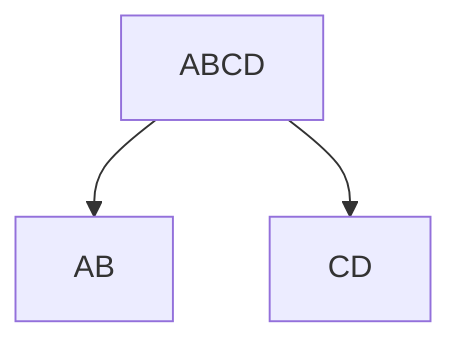
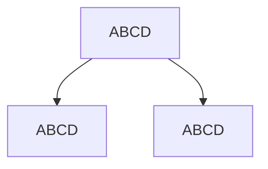
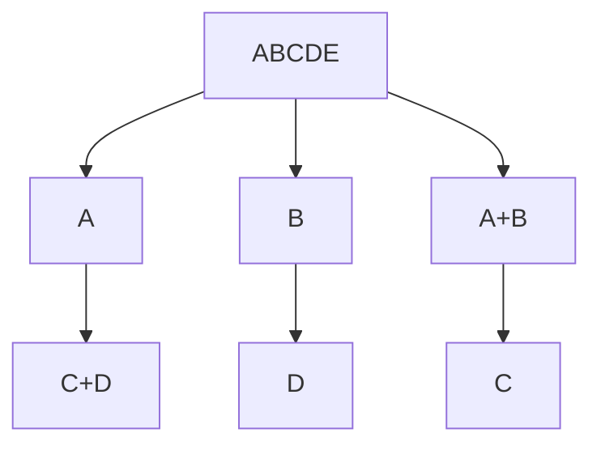
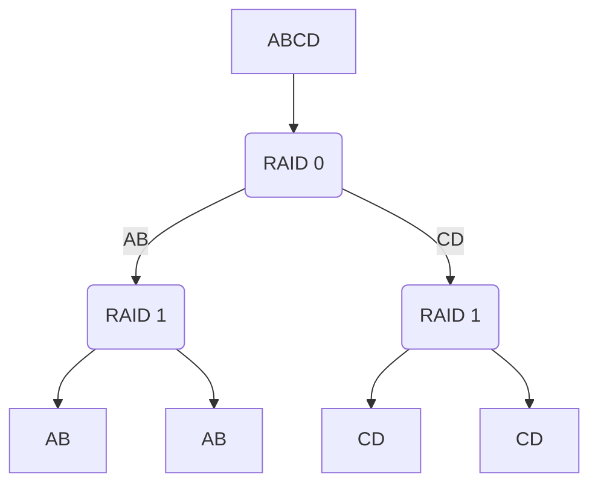

# 2019-08-15-硬件基础Part3

ALC662声卡

217LN网卡

## MBR 和 GPT

| MBR                                | GPT                  |
| ---------------------------------- | -------------------- |
| Win7                               | Win10                |
| Legacy引导                         | UEFI引导             |
| 最多4个主分区                      | 不限制主分区数量     |
| 最大支持单硬盘2T，超过部分识别不到 | 最大支持单硬盘超过2T |

## RAID

配置方式

开机显示logo时按Ctrl+F1

### RAID 0

RAID 0 必须使用两块及以上的硬盘，识别为一块硬盘（二分容量），主要用于文件加速

把数据拆分开来放到多个磁盘里，读取速度更快

### RAID 1

RAID 1 必须要两块及以上的硬盘，识别一个硬盘和单个容量，主要用于备份

一份数据写到多个磁盘，用于备份

### RAID 5

RAID 5 需要三块及以上的硬盘，每块硬盘都会存放一部分备份数据，容量是磁盘总量减去1个磁盘容量

### RAID 10

需要四块及以上的硬盘

## 6代和之后的CPU安装Win7的注意事项

6代或者Skylake构架之后的CPU安装Win7时，由于USB3的驱动问题会导致键鼠失灵或者硬盘不识别

M.2 SSD只能用UEFI引导MBR，而Win7只有64位版本支持UEFI启动

大致注意点

| 硬盘    | 额外操作                                      |
| ------- | --------------------------------------------- |
| HDD     | 提前打USB3.0驱动到ISO镜像里                   |
| SSD     | 提前打USB3.0驱动到ISO镜像里                   |
| M.2 SSD | 提前打USB3.0驱动到ISO镜像里，加载额外硬盘驱动 |